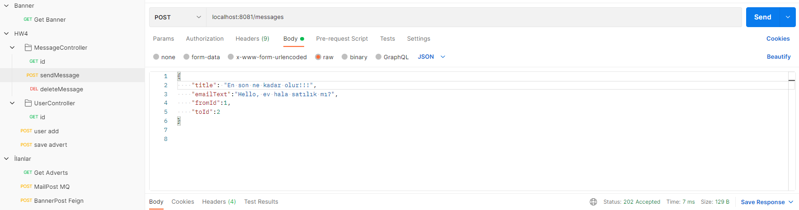
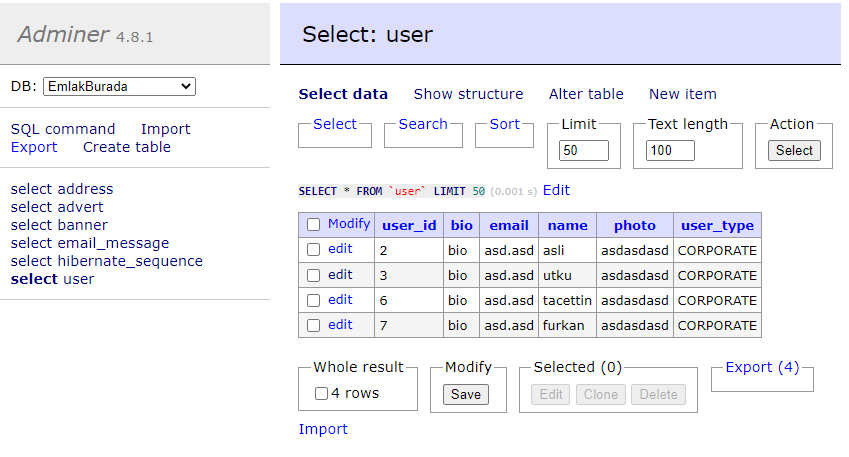
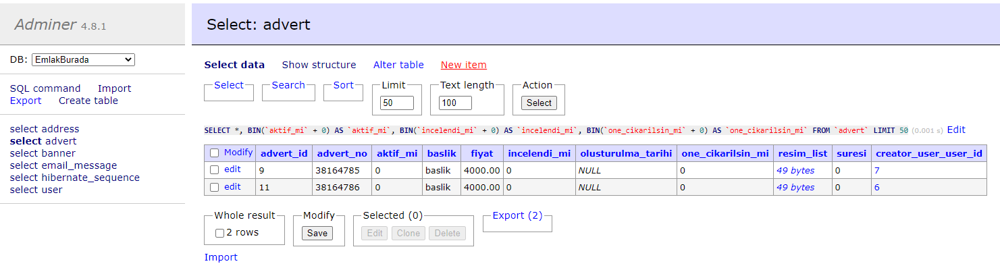
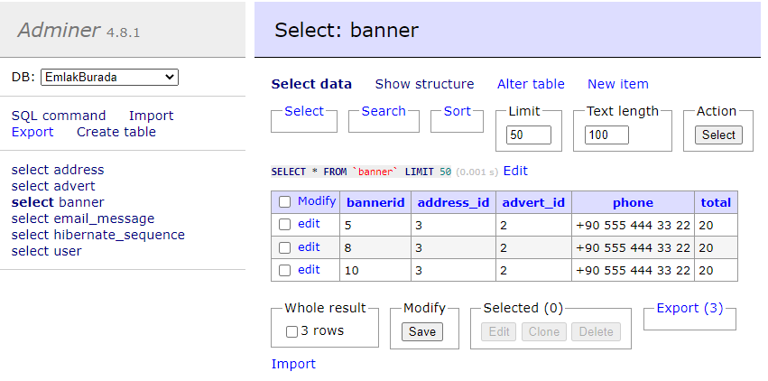
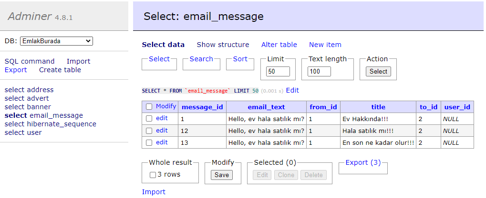

##  170. Hepsiemlak Java Spring Bootcamp

###### Tacettin Utku Süer

#### Ödev 4 Soru 1

EmlakBurada uyguluması üzerinden ilan, kullanıcı, banner ve mesaj için GET, POST ile database CRUD işlemleri yapılabiliyor. 

EmlakBurada üzerinden Rest Client ile doğrudan senkron iletişim ile banner servisine bilgi aktarılarak banner servisi database ile yazma okuma işlemleri yapılabiliyor.

EmlakBurada-Email servisi hem dışarıya e-mail atabiliyor hem de bu maili database'e yazıyor, EmlakBurada servisinde email silme ve okuma yapılabiliyor ama yazma işlemi sadece email servisi üzerinden yapılabiliyor. Bu email servisi böylece aynı zamanda mesajlarıda yönetmiş oluyor. Email servisi ile ana servis arasındaki iletişim asenkron olarak RabbitMQ ile yapılmaktadır.

GET, POST aşağıdaki görselde görüldüğü gibi postman üzerinden yapılmaktadır.

Yukarıda anlatılmış olan işlemler sonucunda database'deki tablolar aşağıda gösterilmektedir.

